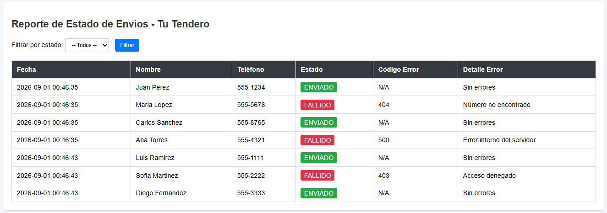

# Módulo de Reporte de Envíos WhatsApp - Tu Tendero

## Descripción del Proyecto
Aplicación web desarrollada en PHP para la visualización y filtrado dinámico del estado de envíos de mensajes de WhatsApp almacenados en una base de datos SQL Server.

## Vista Previa del Sistema 


## Tecnologías Utilizadas
* PHP 8.2 (XAMPP Environment)
* Microsoft SQL Server Express
* Drivers de conexión: `sqlsrv` y `pdo_sqlsrv` (v5.12.0)
* HTML5 / CSS3

## Requisitos Previos e Instalación
1. Mover la carpeta del proyecto `reporte-whatsapp` a la ruta `C:\xampp\htdocs\`.
2. Asegurarse de tener habilitadas las extensiones de SQL Server en `php.ini`:
   * `extension=php_sqlsrv_82_ts_x64.dll`
   * `extension=php_pdo_sqlsrv_82_ts_x64.dll`
3. Abrir SQL Server Management Studio (SSMS) y ejecutar el archivo `script_base_de_datos.sql` adjunto en este repositorio.
4. Reiniciar el servidor web Apache desde el panel de XAMPP.

## Configuración de Conexión
En el archivo `index.php`, ajustar la variable `$serverName` según la instancia de SQL Server local si difiere:
```php
$serverName = "DESKTOP-Q681RM2\SQLEXPRESS";

Ejecución
Acceder desde el navegador a la ruta local:
http://localhost/reporte-whatsapp/